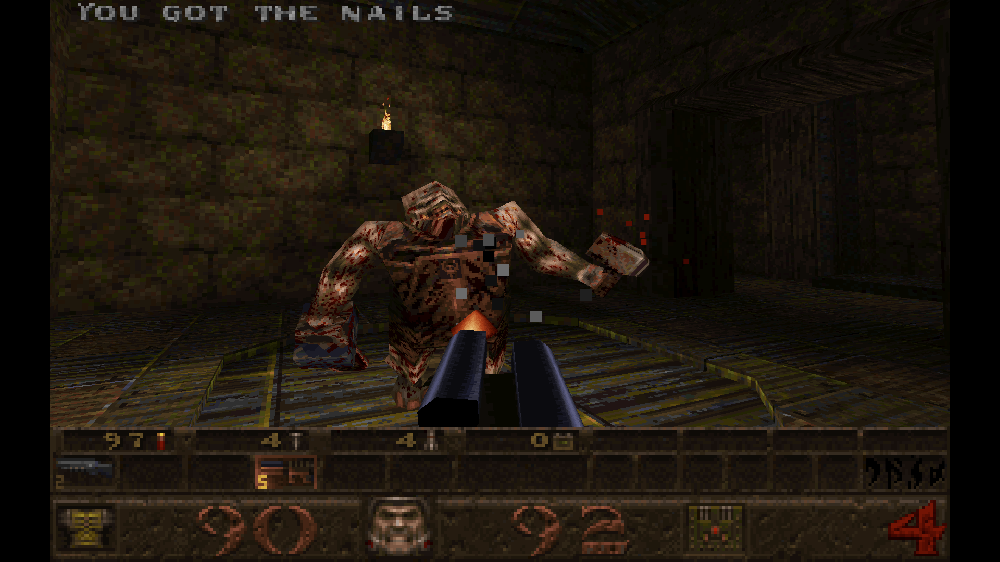

# Quake for PlayCanvas

An in-progress, source-faithful TypeScript port of the original 1996 Quake runtime to [PlayCanvas](https://playcanvas.com/). It reads the original Quake data formats directly rather than replacing maps, models, textures, or interface artwork.



The project currently focuses on the shareware game and its E1M1 vertical slice. It is not yet a complete Quake implementation.

## Requirements

- Node.js 22 or newer
- npm
- A `tar` implementation capable of extracting LHA archives; current Windows installations include a compatible `bsdtar`

## Run locally

```sh
npm install
npm run prepare:shareware
npm run dev
```

Open `http://127.0.0.1:5173`. Use `?map=e1m1` to start E1M1 directly, or `?demo=demo1` to play an original demo.

`prepare:shareware` downloads the historical Quake 1.06 shareware installer, verifies the archive and extracted PAK, and writes it under the gitignored `.quake-data/` directory. Alternatively, place a legally owned compatible PAK at `.quake-data/id1/pak0.pak`.

## Controls

- WASD: move
- Mouse: look and fire
- Space or Enter: jump
- Shift: run
- Number keys or mouse wheel: change weapon
- Escape: menu
- Backquote: console
- Tab: scoreboard
- Pause/Break: pause

Click the game before playing to capture the pointer and enable audio. Controls can be changed through **Options → Customize controls**.

## Build and test

```sh
npm run build
npm run preview
```

Run all static checks, tests, and the production build with:

```sh
npm run check
```

Individual commands are also available through `npm run lint`, `npm run typecheck`, and `npm test`.

## Deploy to GitHub Pages

The repository includes a GitHub Actions workflow that tests, builds, and deploys a playable site whenever `main` is updated. After pushing the repository to GitHub, open **Settings → Pages** and select **GitHub Actions** as the deployment source. The workflow can also be started manually from the Actions tab.

The Pages artifact contains the original verified Quake 1.06 shareware archive in its permitted compressed form. The browser extracts `pak0.pak` in memory at startup; extracted game data is not committed to the repository or published as a loose file.

## Project status

See [DEVELOPMENT.md](DEVELOPMENT.md) for implemented features, known gaps, and detailed progress notes. Native-renderer comparison methodology and results are documented in [docs/visual-validation.md](docs/visual-validation.md).

## Game data and music

No Quake game data is committed to this repository. The shareware PAK does not include the original CD soundtrack; legally obtained tracks can be placed under `.quake-data/id1/music/` using conventional names such as `track06.ogg`.

## License

The port source is licensed under GPL-2.0; see [LICENSE](LICENSE). PlayCanvas is MIT-licensed and remains an external npm dependency. Quake game data and trademarks are not covered by this repository's source license.
